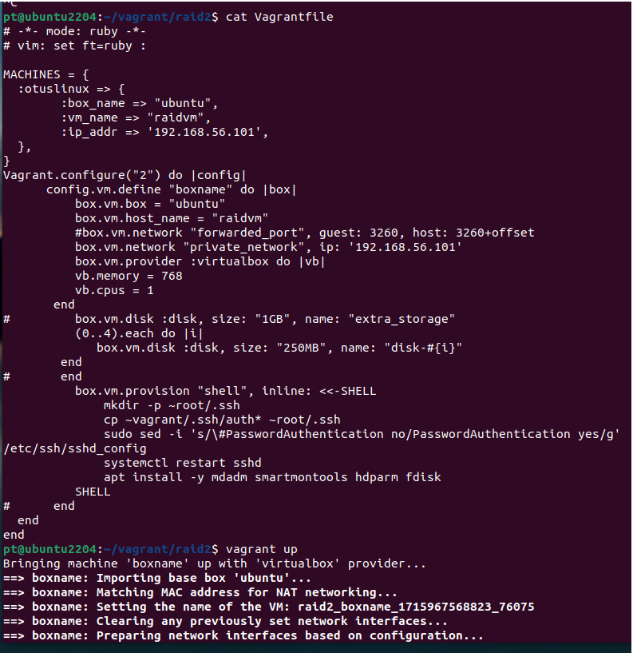
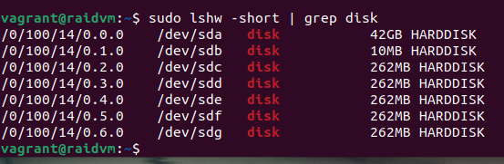

homework-RAID
Описание домашнего задания
---
1. добавить в Vagrantfile еще дисков;
2. собрать R0/R5/R10 на выбор;
3. прописать собранный рейд в конф, чтобы рейд собирался при загрузке;
4. сломать/починить raid;
5. создать GPT раздел и 5 партиций и смонтировать их на диск.

---
- Этап 1: Vagrantfile изменен, прописан код для добавления дисков в ВМ
   



```bash
sudo fdisk -l
```


- Этап 2: Собран R10 
  


Занулим на всякий случай суперблоки


Ответ команды дает понять, что диски не использовались ранее для RAID. продолжаем

Собираем raid


Проверяем


Раз у нас остался пятый диск, можно попробовать добавить его в raid в качестве горячей замены


- Этап 3: Пропишем собранный рейд в конфиг, чтобы рейд собирался при загрузке
```bash
mdadm --detail --scan --verbose | awk '/ARRAY/ {print}' >> /etc/mdadm/mdadm.conf
# Тут так просто не получилось, пришлось заходить в суперпользователя
```


Убедимся, что файл записан


- Этап 4: Сломаем, а затем починим raid
```bash
mdadm /dev/md0 --fail /dev/sde
```


Ну, в моем случае подтянулся диск горячей замены)), сломаем еще немного, "выдернув" еще диск


Удалим "сломанный" диск из рейда и вернем обратно, будто новый

```bash
#момент построения рейда я пропустил, слишком быстро было
```


- Этап 5: Создадим GPT раздел и 5 партиций и смонтируем их на диск
```bash
parted -s /dev/md0 mklabel gpt #Создаем раздел GPT на RAID
parted /dev/md0 mkpart primary ext4 0% 20% #Создаем партиции (5 комманд с шагом в 20%) 
for i in $(seq 1 5); do sudo mkfs.ext4 /dev/md0p$i; done # Создаем на этих партициях ФС
mkdir -p /raid/part{1,2,3,4,5}
for i in $(seq 1 5); do mount /dev/md0p$i /raid/part$i; done # Монтируем их по каталогам
```


